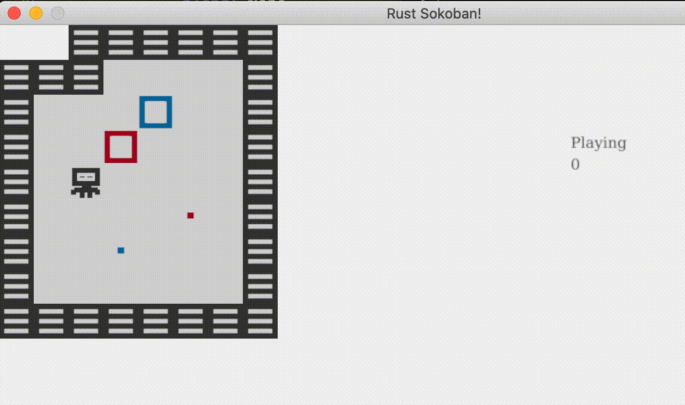

# 动画
在这节中我们给游戏添加点动画效果．这里使用的动画效果比较简单，你也可以基于此添加更复杂的动画效果．这节我们将添加俩种动画效果：让角色眨眼和让盒子抖动． 

## 什么是动画呢?
简单来说动画就是按照特定时间间隔展现一系列帧,从而让素材动起来,就像视频(视频就是播放一系列图片)，但是使用的帧率比较低.

比如要让角色眨眼睛我们需要３个动画帧(图片).

For example, to get our player blinking we'll have three animation frames: 
1. 一张眼睛张开的角色图片
1. 一张眼睛微闭的角色图片
1. 一张眼睛完全闭上的角色图片

你可以通过图片浏览器快速的翻动图片尝试按顺序播放这三张图片,会看到角色在眨眼睛．

还需要说明的是: 
* 需要按照一个特定的帧率播放素材 - 每250毫秒播放一个图片也就是每秒种播放4个图片．
* 素材必须连贯- 想象一下我们已经有了两张不同眼睛状态的图片，现在如果第３张图片跟前面的图片不连贯，那做出来的动画效果看起来就会很奇怪了.
* 准备动画素材是很费事的，所以我们只简单的创建一些关键帧的图片.

## 怎么实现动画呢?
在我们的推箱子游戏中怎么实现呢？我们需要:
1. 让可渲染组件支持多帧- 为此我们本应该重新创建个可渲染组件，这样可以保持原来的静态可渲染组件不变．简单起见我们直接写到一起了．
1. 修改角色实体构造器使其可以接受多个帧
1. 跟踪渲染循环中的时间 - 我们稍后再详细介绍这个.现在不清楚做什么也不用担心.
1. 让渲染系统支持按照特定时间渲染一系列帧.

## 素材
接下来我们新增些玩家素材．看起来就像下面这样.需要注意的是我们按照图片顺序命名的文件名称，你也可以采用其它的方式命名，但这样有助于分辨图片顺序.


```
├── resources
│   └── images
│       ├── box_blue.png
│       ├── box_red.png
│       ├── box_spot_blue.png
│       ├── box_spot_red.png
│       ├── floor.png
│       ├── player_1.png
│       ├── player_2.png
│       ├── player_3.png
│       └── wall.png
```

## 可渲染组件
接下来我们修改可渲染组件，原来是接受一个路径渲染，现在需要接受一系列路径．

让我们创建俩个构建函数分别用于创建两种类型的可渲染组件，一个只接受一个路径做为参数，另一个可以接受多个路径.这俩个函数是关联在 `Renderable`类型上的关联函数，而不是与某个实例关联,因此这俩个函数不需要接受`&self`或者`＆mut self`为参数，在其它编程语言中可能叫静态函数.你可以把他们看成是工厂函数，因为他们封装了验证和构建对象的逻辑．

> **_MORE:_**  点 [这里](https://doc.rust-lang.org/book/ch05-03-method-syntax.html#associated-functions)获取更多关联函数知识.

```rust
// components.rs
{{#include ../../../code/rust-sokoban-c03-02/src/components.rs:19:32}}
{{#include ../../../code/rust-sokoban-c03-02/src/components.rs:48}}
```

接下来我们需要在渲染系统中判断可渲染组件是有动画效果的还是静态的．我们可以通过获取到的图片路径是一个还是多个来判断是哪种类型的渲染组件,还有种更专业的做法:创建一个枚举对象用于表示可渲染组件类型，然后在可渲染对象中添加一个函数用于获取渲染类型．这样就可以把判断渲染类型的逻辑封装在一个函数中，也不需要对外部公开`path`属性了.可以在`components.rs`的任何地方定义我们的枚举类型，但最好紧挨着渲染组件．

```rust
// components.rs
{{#include ../../../code/rust-sokoban-c03-02/src/components.rs:14:18}}
```

现在我们增加根据`paths`的长度判断渲染类型的函数:

```rust
// components.rs
{{#include ../../../code/rust-sokoban-c03-02/src/components.rs:25:40}}
{{#include ../../../code/rust-sokoban-c03-02/src/components.rs:48}}
```

最后，由于`paths`属性是私有的外部不能获取，我们需要提供一个公开函数让外部可以获取到图片路径．对于静态可渲染组件只需要返回第一个路径就可以了．对于动态可渲染组件可以根据索引获取到相应的图片，这里有点小难的是当索引超过路径总数时，我们需要先使用路径总数对索引取模，再使用取模后的值做为索引获取路径.

```rust
// components.rs
{{#include ../../../code/rust-sokoban-c03-02/src/components.rs:25}}

    //...

{{#include ../../../code/rust-sokoban-c03-02/src/components.rs:42:48}}
```

## 创建实体
接下来我们修改创建角色的代码，角色是动态组件所以我们使用`new_animated` 函数创建.

```rust
// entities.rs
{{#include ../../../code/rust-sokoban-c03-02/src/entities.rs:48:60}}
```

然后是使用 `new_static` 函数创建墙等静态组件(其它静态组件与墙类似，不再一一贴出).

```rust
// entities.rs
{{#include ../../../code/rust-sokoban-c03-02/src/entities.rs:5:14}}
```

## 渲染时机
我们还需要一个用于确定动画渲染时机的组件．我们该在什么时间怎样按照特定帧率执行动画渲染操作?简单的做法是:ggez控制着渲染系统的执行周期，但这个周期取决于每次循环时执行的工作量，也就是说这个频率是不稳定的，１秒钟可能执行60次也可能执行57次，甚至只执行30次．这也就意味着我们不能确保动画系统按照特定的频率渲染，我们需要自己控制动画的渲染时机.

因此我们需要跟踪记录空闲时间或者说是上一个循环结束到当前循环的时间．由于空闲时间比帧间隔（250ms）小的多,我们需要记录下累积的空闲时间，也就是从游戏运行开始的所以空闲时间.

> **_MORE:_**  了解更多关于空闲时间,帧率,游戏循环的知识请点 [这里](https://medium.com/@dr3wc/understanding-delta-time-b53bf4781a03#:~:text=Delta%20time%20describes%20the%20time,drawn%20and%20the%20current%20frame.&text=If%20you%20read%20my%20article,until%20the%20game%20is%20stopped.), [这里](https://www.reddit.com/r/pcmasterrace/comments/29qcqr/an_explanation_of_game_loops_fps_and_delta_time/) 还有 [这里](https://www.youtube.com/watch?v=pctGOMDW-HQ&list=PLlrATfBNZ98dC-V-N3m0Go4deliWHPFwT&index=37) .

现在就让我们添加一个时间资源,之所以是资源因为它需要用于记录全局状态信息而不适合组件模型.

```rust
// resources.rs
{{#include ../../../code/rust-sokoban-c03-02/src/resources.rs:45:48}}
```

别忘了注册下新创建的资源:

```rust
// resources.rs
{{#include ../../../code/rust-sokoban-c03-02/src/resources.rs:12:16}}
```

接下来我们就可以在主循环里更新时间信息了.幸运的是ggez已经提供了获取空闲时间的函数,我们只需要调用函数获取空闲时间并累加就好了:

```rust
// main.rs
{{#include ../../../code/rust-sokoban-c03-02/src/main.rs:24:45}}
```


## 渲染系统
现在我们需要修改渲染系统的代码.获取可渲染组件的类型，根据据类型判断如果是静态的就渲染第一个图片就可以了，如果是动态组件就使用当前累计的空闲时间找到相应的图片渲染就可以了．

我们先把找图片的逻辑封装到一个函数`get_image`里：

```rust
// rendering_system.rs
{{#include ../../../code/rust-sokoban-c03-02/src/systems/rendering_system.rs:17}}
    //...
{{#include ../../../code/rust-sokoban-c03-02/src/systems/rendering_system.rs:34:54}}
```

最后在运行函数中使用 `get_image` 函数(另外我们还需要在 `SystemData` 中定义`Time`，再添加一些导入语句什么的就可以了).

```rust
// rendering_system.rs
{{#include ../../../code/rust-sokoban-c03-02/src/systems/rendering_system.rs:57:81}}

            //...
            
{{#include ../../../code/rust-sokoban-c03-02/src/systems/rendering_system.rs:88}}

        //...

{{#include ../../../code/rust-sokoban-c03-02/src/systems/rendering_system.rs:97}}
{{#include ../../../code/rust-sokoban-c03-02/src/systems/rendering_system.rs:98}}

```

## 给盒子添加动画效果
现在我们已经学会怎么添加动画效果了，依葫芦画瓢也给盒子添加上动画效果吧．下面是我使用的素材，仅供参考,你也可以创建自己的素材.


## 总结
这节有点长，恭喜你成功看到了这里． 我们的游戏现在看起来像这样：



> **_CODELINK:_**  点 [这里](https://github.com/iolivia/rust-sokoban/tree/master/code/rust-sokoban-c03-02)获取完整实例代码.